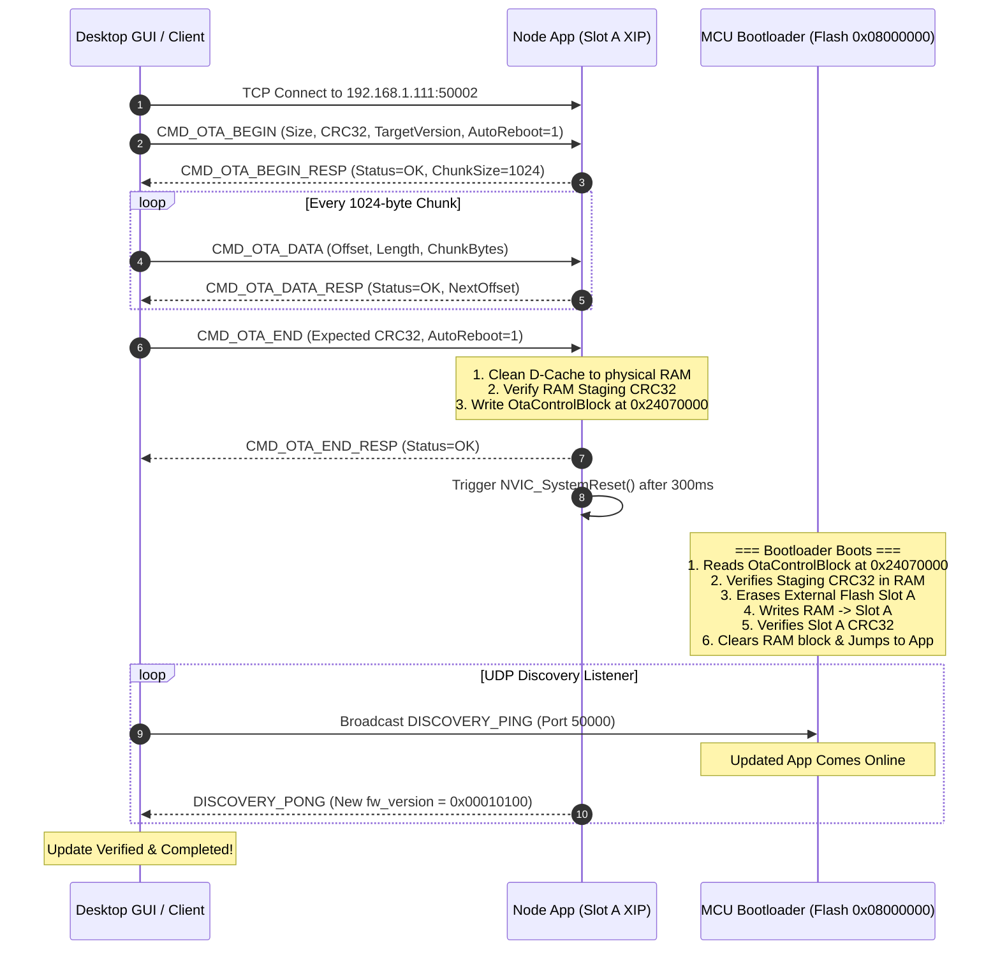

# Desktop Software Team: Ethernet OTA Integration Guide

## Overview

EmbeddedPixel nodes support field firmware updates over standard Ethernet TCP/IP connections. The target architecture uses a **RAM-staged Dual-Stage Bootloader** design. Incoming firmware binaries are received over TCP, staged into MCU internal AXI SRAM, verified with IEEE 802.3 CRC32, and then installed by the bootloader into External Macronix Octal-SPI Flash (`0x70000000`) upon a soft reset.

This document specifies the exact packet structures, command sequence, checksum algorithms, state machine flow, timing parameters, and error recovery for client/desktop GUI applications.

---

## 1. Network & Port Configuration

| Parameter | Value | Description |
|---|---|---|
| **Protocol** | Raw TCP / UDP | Little-Endian byte order |
| **Command TCP Port** | `50002` | Used for OTA Transfer (`CMD_OTA_*`) and Node Management |
| **Discovery UDP Port** | `50000` | Node heartbeat broadcasts (1 Hz) and `DISCOVERY_PING` / `DISCOVERY_PONG` |
| **Telemetry UDP Port** | `50001` | High-speed multi-channel streaming |
| **Max Image Size** | `163,840` bytes (160 KB) | Staged directly in MCU AXI SRAM |
| **Recommended Chunk Size** | `1,024` bytes | Up to 1024 bytes per `CMD_OTA_DATA` packet |

---

## 2. Packet Framing & Header Format

All TCP commands and responses share a fixed **16-byte header** (`PE_Header`), followed immediately by the command payload.

### `PE_Header` (16 bytes, Little-Endian)

| Offset | Field | Type | Description |
|---|---|---|---|
| `0x00` | `magic` | `uint16_t` | Constant magic number: `0x5045` (`'PE'`) |
| `0x02` | `proto_version` | `uint8_t` | Protocol version: `1` |
| `0x03` | `flags` | `uint8_t` | Bitmask: `0x01` = Request Ack, `0x02` = Is Response, `0x80` = Error Flag |
| `0x04` | `node_id` | `uint16_t` | Target Node ID (e.g. `1` or `0` for broadcast) |
| `0x06` | `msg_type` | `uint16_t` | Command/Message Type ID (see table below) |
| `0x08` | `seq_num` | `uint32_t` | Monotonically incrementing transaction sequence number |
| `0x0C` | `payload_len` | `uint16_t` | Length of payload immediately following header |
| `0x0E` | `crc16` | `uint16_t` | Header CRC16-CCITT (`poly=0x1021`, init=`0xFFFF`, calc over first 14 bytes) |

---

## 3. OTA Message Types & Payloads

### Message Type IDs

```c
CMD_OTA_BEGIN         = 0x0180   // Host -> Node: Initiate OTA session
CMD_OTA_BEGIN_RESP    = 0x0181   // Node -> Host: Staging RAM ready
CMD_OTA_DATA          = 0x0182   // Host -> Node: Binary chunk
CMD_OTA_DATA_RESP     = 0x0183   // Node -> Host: Chunk ack / next offset
CMD_OTA_END           = 0x0184   // Host -> Node: Finalize & trigger verify
CMD_OTA_END_RESP      = 0x0185   // Node -> Host: Final verification result
CMD_OTA_ABORT         = 0x0186   // Host -> Node: Cancel active update
CMD_OTA_STATUS        = 0x0187   // Host -> Node: Query current progress
CMD_OTA_STATUS_RESP   = 0x0188   // Node -> Host: Status report
CMD_ACK               = 0x0101   // Generic OK
CMD_NACK              = 0x01FF   // Generic Failure / Rejection
```

---

### A. `CMD_OTA_BEGIN` (`0x0180`)
Initiates the transfer session.

**Payload (`PayloadOtaBegin`, 16 bytes):**
```c
struct PayloadOtaBegin {
    uint32_t image_size;      // Total image size in bytes
    uint32_t image_crc32;     // Full image IEEE 802.3 CRC32
    uint32_t target_version;  // Target version (e.g., 0x00010100 for v1.1.0)
    uint16_t chunk_size;      // Proposed chunk size (1024)
    uint16_t flags;           // Bit 0: Auto-reboot upon successful verification (0x0001)
};
```

**Response (`CMD_OTA_BEGIN_RESP` `0x0181` / `CMD_ACK`):**
```c
struct PayloadOtaBeginResp {
    uint32_t status_code;     // 0 = OK (StatusCode::OK)
    uint16_t chunk_size_ack;  // Accepted chunk size (1024)
    uint16_t max_image_size_kb;// Max staging capacity (160 KB)
};
```

---

### B. `CMD_OTA_DATA` (`0x0182`)
Transfers a binary chunk.

**Payload (`PayloadOtaData`, 8 bytes + `chunk_bytes`):**
```c
struct PayloadOtaData {
    uint32_t offset;          // Byte offset in binary (0, 1024, 2048, ...)
    uint16_t chunk_len;       // Number of payload bytes following this header
    uint16_t chunk_crc16;     // CRC16-CCITT over chunk_bytes (optional, or 0)
    uint8_t  chunk_bytes[];   // Binary data (length = chunk_len)
};
```

**Response (`CMD_OTA_DATA_RESP` `0x0183` / `CMD_ACK`):**
```c
struct PayloadOtaDataResp {
    uint32_t status_code;     // 0 = OK
    uint32_t next_offset;     // Next expected byte offset
};
```

---

### C. `CMD_OTA_END` (`0x0184`)
Signals completion of binary streaming and commands node to perform full RAM CRC32 verification.

**Payload (`PayloadOtaEnd`, 8 bytes):**
```c
struct PayloadOtaEnd {
    uint32_t final_crc32;     // Full image CRC32
    uint16_t auto_reboot;     // 1 = Reboot into bootloader immediately
    uint16_t reserved;        // 0
};
```

**Response (`CMD_OTA_END_RESP` `0x0185` / `CMD_ACK`):**
- Returns `CMD_ACK` (Status `0`) if CRC32 matches and node has staged control block in RAM.
- Returns `CMD_NACK` (Status `ERR_INVALID_CRC` `0x0003`) if verification failed.

---

## 4. Checksum Algorithms

### 1. IEEE 802.3 CRC32 (Full Firmware Image)
- **Polynomial**: `0xEDB88320` (Reflected `0x04C11DB7`)
- **Initial Remainder**: `0xFFFFFFFF`
- **Final XOR**: `0xFFFFFFFF`
- Matches standard Python `binascii.crc32(data)` and POSIX `cksum`.

### 2. CRC16-CCITT (Packet Headers & Chunk Integrity)
- **Polynomial**: `0x1021` (Normal)
- **Initial Remainder**: `0xFFFF`
- **Final XOR**: `0x0000`

---

## 5. End-to-End OTA Flow Sequence



---

## 6. Python Reference Implementation

A complete standalone CLI updater is located at [`scripts/ota_updater.py`](../scripts/ota_updater.py):

```bash
# Execute OTA update
python scripts/ota_updater.py --ip 192.168.1.111 --bin path/to/firmware.bin --version 0x00010100
```
